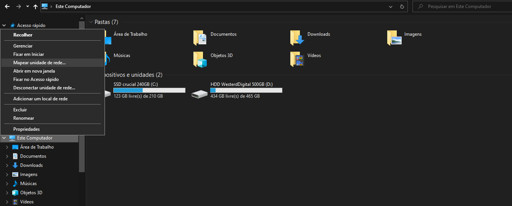
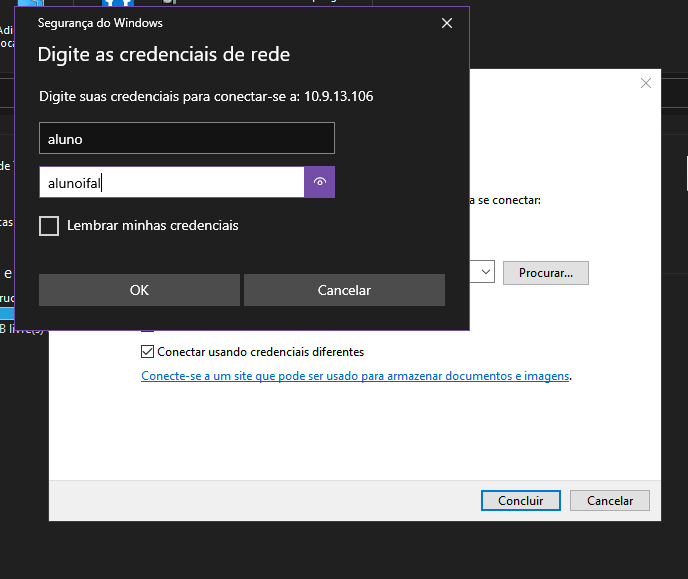
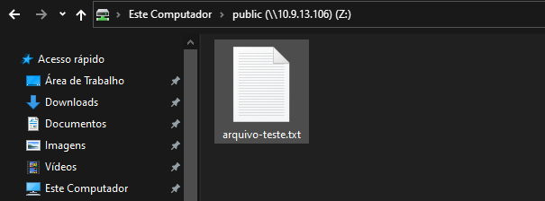

# Compartilhamento de arquivos com Samba

Antes de continuar, certifique-se de ter cumprido os passos descritos no arquivo [README.md](https://github.com/eduardor0cha/projeto-final-inre/blob/main/README.md)

---

## Configurar o servidor de compartilhamento

1. ## Alterar o nome da sua máquina:

    ```bash
    | Samba-SRV. | smb.<grupo>.<turma>.ifalarapiraca.local  |
    ```
    
    Use os comandos:

    ```bash
    sudo hostnamectl set-hostname smb.<grupo>.<turma>.ifalarapiraca.local
    reboot
    ```
        
    Exemplo: 
     ```bash
     sudo hostnamectl set-hostname smb.grupo3.turma913.ifalarapiraca.local
     reboot
     ```  
    Após o reboot confira o nome da máquina com:

    ```
    $ hostname
    smb.grupo3.turma913.ifalara.local
    $ 
    ```
    

2. ## Definir ip da rede interna:

    Use o comando dentro da sua vm para abrir o arquivo de configuração:

    ```bash
    sudo nano /etc/netplan/00-installer-config.yaml
    ```
    O arquivo deverá parecer com isso:

    ```bash
    # This is the network config written by 'subiquity'
    network:
        renderer: networkd
        ethernets:
            ens160:
            dhcp4: false
            addresses: [<ip-da-vm-samba-ens160>/24]
            nameservers:
                addresses:
                  - <ip-da-vm-ns1-ens160>
                  - <ip-da-vm-ns2-ens160>
                search: [<grupo>.<turma>.ifalara.local]
            ens192:
              dhcp4: false
              addresses: [<ip-da-vm-samba-ens192>/28]
              gateway4: <ip-da-vm-gw-ens192>
              nameservers:
                addresses:
                  - <ip-da-vm-ns1-ens192>
                  - <ip-da-vm-ns2-ens192>
                search: [<grupo>.<turma>.ifalara.local]
        version: 2
    ```
    ```bash
    # This is the network config written by 'subiquity'
       network:
       renderer: networkd
       ethernets:
         ens160:
         dhcp4: false
         addresses: [10.9.13.108/24]
         nameservers:
            addresses:
              - 10.9.13.110
              - 10.9.13.112
            search: [grupo3.turma913.ifalara.local]
        ens192:
          dhcp4: false
          addresses: [192.168.13.42/28]
          gateway4: 192.168.13.41
          nameservers:
            addresses:
              - 192.168.13.43
              - 192.168.13.44
            search: [grupo3.turma913.ifalara.local]
  version: 2
    
    ```
    Lembre de aplicar as configurações, conferir se o ip aparece e testar o ping:

    ```bash
    $ sudo netplan apply
    
    $ ifconfig -a
    ens160: flags=4163<UP,BROADCAST,RUNNING,MULTICAST>  mtu 1500
            inet 10.9.13.108  netmask 255.255.255.0  broadcast 10.9.13.255
            inet6 fe80::20c:29ff:fe92:96fa  prefixlen 64  scopeid 0x20<link>
            ether 00:0c:29:92:96:fa  txqueuelen 1000  (Ethernet)
            RX packets 90602  bytes 27762094 (27.7 MB)
            RX errors 0  dropped 420  overruns 0  frame 0
            TX packets 27790  bytes 3292141 (3.2 MB)
            TX errors 0  dropped 0 overruns 0  carrier 0  collisions 0

    ens192: flags=4163<UP,BROADCAST,RUNNING,MULTICAST>  mtu 1500
            inet 192.168.13.42  netmask 255.255.255.240  broadcast 192.168.13.47
            inet6 fe80::20c:29ff:fe92:9604  prefixlen 64  scopeid 0x20<link>
            ether 00:0c:29:92:96:04  txqueuelen 1000  (Ethernet)
            RX packets 837975  bytes 299335674 (299.3 MB)
            RX errors 0  dropped 530  overruns 0  frame 0
            TX packets 14828  bytes 1892853 (1.8 MB)
            TX errors 0  dropped 0 overruns 0  carrier 0  collisions 0

    lo: flags=73<UP,LOOPBACK,RUNNING>  mtu 65536
            inet 127.0.0.1  netmask 255.0.0.0
            inet6 ::1  prefixlen 128  scopeid 0x10<host>
            loop  txqueuelen 1000  (Local Loopback)
            RX packets 5393  bytes 375806 (375.8 KB)
            RX errors 0  dropped 0  overruns 0  frame 0
            TX packets 5393  bytes 375806 (375.8 KB)
            TX errors 0  dropped 0 overruns 0  carrier 0  collisions 0
            
    $ ping <ip-da-vm-gw-ens192>
    
    Exemplo:
    
    $ ping 10.9.13.106
    PING 10.9.13.106 (10.9.13.106) 56(84) bytes of data.
    64 bytes from 10.9.13.106: icmp_seq=1 ttl=64 time=0.172 ms
    64 bytes from 10.9.13.106: icmp_seq=2 ttl=64 time=0.254 ms
    64 bytes from 10.9.13.106: icmp_seq=3 ttl=64 time=0.211 ms
    ^C
    --- 10.9.13.106 ping statistics ---
    3 packets transmitted, 3 received, 0% packet loss, time 2044ms
    rtt min/avg/max/mdev = 0.172/0.212/0.254/0.033 ms

3. ## Instalar e configurar o Samba

    Caso já esteja na vm do samba prossiga, caso não, conecte-se à vm:
    ```bash
    ssh administrador@<ip-da-vm-samba-ens160>
    ```
    Instale o servidor samba:
    ```bash
    sudo apt update
    sudo apt install samba
    ```

    Verifique se o Samba está ativo:

    ```bash
    $ whereis samba
    samba: /usr/sbin/samba /usr/lib/x86_64-linux-gnu/samba /etc/samba /usr/share/samba /usr/share/man/man7 /samba.7.gz /usr/share/man/man8/samba.8.gz
    
    $ sudo systemctl status smbd
    ● smbd.service - Samba SMB Daemon
     Loaded: loaded (/lib/systemd/system/smbd.service; enabled; vendor preset: enabled)
     Active: active (running) since Thu 2022-12-22 13:42:14 UTC; 1 weeks 0 days ago
       Docs: man:smbd(8)
             man:samba(7)
             man:smb.conf(5)
   Main PID: 62023 (smbd)
     Status: "smbd: ready to serve connections..."
      Tasks: 5 (limit: 462)
     Memory: 16.9M
     CGroup: /system.slice/smbd.service
             ├─ 62023 /usr/sbin/smbd --foreground --no-process-group
             ├─ 62025 /usr/sbin/smbd --foreground --no-process-group
             ├─ 62026 /usr/sbin/smbd --foreground --no-process-group
             ├─ 62027 /usr/sbin/smbd --foreground --no-process-group
             └─318344 /usr/sbin/smbd --foreground --no-process-group

    Dec 23 17:19:50 samba-srv smbd[104081]: pam_unix(samba:session): session closed for user aluno
    Dec 23 17:19:50 samba-srv smbd[105052]: pam_unix(samba:session): session opened for user aluno by >
    Dec 23 19:33:10 samba-srv smbd[105052]: pam_unix(samba:session): session closed for user aluno
    Dec 23 23:43:40 samba-srv smbd[114681]: pam_unix(samba:session): session opened for user aluno by >
    Dec 24 03:07:33 samba-srv smbd[114681]: pam_unix(samba:session): session closed for user aluno
    Dec 24 21:44:21 samba-srv smbd[148673]: pam_unix(samba:session): session opened for user aluno by >
    Dec 24 21:50:22 samba-srv smbd[148673]: pam_unix(samba:session): session closed for user aluno
    Dec 24 22:04:07 samba-srv smbd[149160]: pam_unix(samba:session): session opened for user aluno by >
    Dec 25 00:25:47 samba-srv smbd[149160]: pam_unix(samba:session): session closed for user aluno
    Dec 29 13:02:00 samba-srv smbd[318344]: pam_unix(samba:session): session opened for user aluno by >
    lines 1-27/27 (END)

    $ netstat -an | grep LISTEN
    tcp        0      0 127.0.0.1:139           0.0.0.0:*               LISTEN     
    tcp        0      0 10.9.13.108:139         0.0.0.0:*               LISTEN     
    tcp        0      0 192.168.13.42:139       0.0.0.0:*               LISTEN     
    tcp        0      0 127.0.0.53:53           0.0.0.0:*               LISTEN     
    tcp        0      0 0.0.0.0:22              0.0.0.0:*               LISTEN     
    tcp        0      0 127.0.0.1:445           0.0.0.0:*               LISTEN     
    tcp        0      0 10.9.13.108:445         0.0.0.0:*               LISTEN     
    tcp        0      0 192.168.13.42:445       0.0.0.0:*               LISTEN     
    tcp6       0      0 :::22                   :::*                    LISTEN  
    ```
    Faça um backup do arquivo smb.conf e crie outro arquivo apenas com os comandos necessários, excluindo os comentários:
    ```bash
    sudo cp /etc/samba/smb.conf{,.backup}
    ls -la
    sudo bash -c 'grep -v -E "^#|^;" /etc/samba/smb.conf.backup | grep . > /etc/samba/smb.conf'
    ```
    ## Edite o arquivo smb.conf:
    
    ```bash
    sudo nano /etc/samba/smb.conf
    ```
    Crie a linha "interfaces = 127.0.0.1/8 ens160 ens192.":

    ```bash
    [global]
        workgroup = WORKGROUP
        netbios name = samba-srv
        security = user
        server string = %h server (Samba, Ubuntu)
        interfaces = 127.0.0.1/8 ens160 ens192
        bind interfaces only = yes
        log file = /var/log/samba/log.%m
        max log size = 1000
        logging = file
        panic action = /usr/share/samba/panic-action %d
        server role = standalone server
        obey pam restrictions = yes
        unix password sync = yes
        passwd program = /usr/bin/passwd %u
        passwd chat = *Enter\snew\s*\spassword:* %n\n *Retype\snew\s*\spassword:* %n\n *password\supdated\ssuccessfully* .
        pam password change = yes
        map to guest = bad user
        usershare allow guests = yes
    [printers]
        comment = All Printers
        browseable = no
        path = /var/spool/samba
        printable = yes
        guest ok = no
        read only = yes
        create mask = 0700
    [print$]
        comment = Printer Drivers
        path = /var/lib/samba/printers
        browseable = yes
        read only = yes
        guest ok = no
    [homes]
        comment = Home Directories
        browseable = yes
        read only = no
        create mask = 0700
        directory mask = 0700
        valid users = %S
    [public]
        comment = public anonymous access
        path = /samba/public
        browsable =yes
        create mask = 0660
        directory mask = 0771
        writable = yes
        guest ok = yes
        guest only = yes
        force user = nobody
        force create mode = 0777
        force directory mode = 0777
    ```
    Reinicie o serviço smbd:

    ```bash
    sudo systemctl restart smbd
    ```
    Agora modifique esse mesmo arquivo para que apenas usuários do grupo sambashare possam acessar, bloqueando acessos não autorizados, faça da seguinte maneira:

    ```bash
    [public]
        comment = public anonymous access
        path = /samba/public
        browsable =yes
        create mask = 0660
        directory mask = 0771
        writable = yes
        guest ok = no
        valid users = @sambashare
        #guest only = yes
        #force user = nobody
        #force create mode = 0777
        #force directory mode = 0777
    ```
4. ### Criar e vincular um usuário ao serviço Samba:
    Caso já tenha criado o usuário "aluno" pule esta etapa, caso não, crie-o (lembre da senha pois será usada mais tarde):
    ```bash
    sudo adduser aluno
    ```
    Agora vincule o usuário ao serviço Samba:

    ```bash
    sudo smbpasswd -a aluno
    sudo usermod -aG sambashare aluno
    ```
5. ### Criar o diretório compartilhado:
    ```bash
    mkdir /home/aluno/sambashare/
    sudo mkdir -p /samba/public 
    ```
   Atualize as permissões do diretório:
   ```bash
   sudo chown -R nobody:nogroup /samba/public
   sudo chmod -R 0775 /samba/public
   sudo chgrp sambashare /samba/public
    ```
   Cheque se as permissões foram atualizadas:
   ```bash
    $ getent group | grep sambashare
    sambashare:x:119:aluno
    $ ls -la
    total 12
    drwxr-xr-x  3 root   root       4096 Dec 21 20:39 .
    drwxr-xr-x 20 root   root       4096 Dec 21 20:39 ..
    drwxrwxr-x  2 nobody sambashare 4096 Dec 22 14:47 public
   ```
    
6. ### Acessar a pasta compartilhada:
    Em um computador Windows abra o Explorador de arquivos, clique com o botão direito em "Mapear unidade"e digite: `\\<ip-da-vm-samba-ens160>\public` ;
    Exemplo: `\\10.9.13.106\public`.

    
    
    
    

## Conclusão

Pronto! Se tudo ocorreu como o planejado, a sua máquina já está desempenhando a função de servidor Samba!
