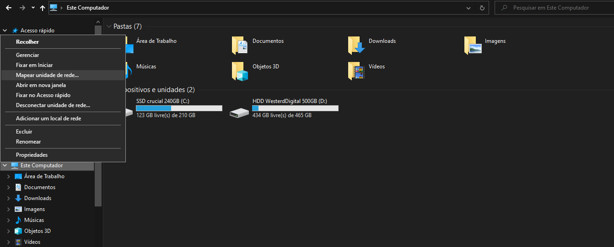
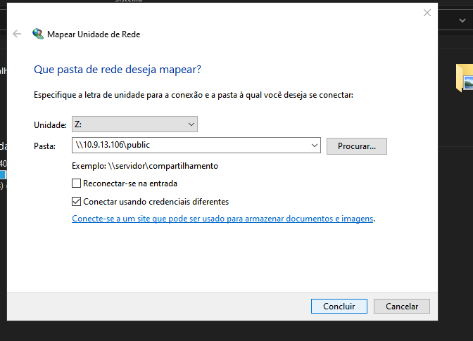
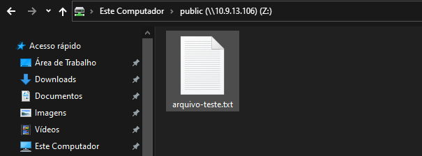

# Compartilhamento de arquivos com Samba

Antes de continuar, certifique-se de ter cumprido os passos descritos no arquivo [README.md](https://github.com/eduardor0cha/projeto-final-inre/blob/main/README.md)

---

## Configurar o servidor de compartilhamento

1. ## Alterar o nome da sua máquina:

    ```bash
    | Samba-SRV. | samba.<aluno_turma>.labredes.ifalarapiraca.local  |
    ```
    Use os comandos:

    ```bash
    sudo hostnamectl set-hostname samba-srv
    reboot
    ```
    Após o reboot confira o nome da máquina com:

    ```
    hostnamectl
    ```

2. ## Definir ip da rede interna:

    Use o comando dentro da sua vm para abrir o arquivo de configuração:

    ```bash
    sudo nano /etc/netplan/00-installer-config.yaml
    ```
    O arquivo deverá parecer com isso:

    ```bash
    # This is the network config written by 'subiquity'
    network:
        renderer: networkd
        ethernets:
            ens160:
            dhcp4: false
            addresses: [<ip-da-vm-samba-ens160>/24]
            nameservers:
                addresses:
                - <ip-da-vm-ns1-ens160>
                - <ip-da-vm-ns2-ens160>
            ens192:
            dhcp4: false
            addresses: [<ip-da-vm-samba-ens192>/28]
            gateway4: <ip-da-vm-gw-ens192>
        version: 2
    ```
    Lembre de aplicar as configurações, conferir se o ip aparece e testar o ping:

    ```bash
    sudo netplan apply
    ifconfig -a
    ping <ip-da-vm-gw-ens192>
    ```

3. ## Instalar e configurar o Samba

    Caso já esteja na vm do samba prossiga, caso não, conecte-se à vm:
    ```bash
    ssh administrador@<ip-da-vm-samba-ens160>
    ```
    Instale o servidor samba:
    ```bash
    sudo apt update
    sudo apt install samba
    ```

    Verifique se o Samba está ativo:

    ```bash
    whereis samba
    sudo systemctl status smbd
    netstat -an | grep LISTEN
    ```
    Faça um backup do arquivo smb.conf e crie outro arquivo apenas com os comandos necessários:
    ```bash
    sudo cp /etc/samba/smb.conf{,.backup}
    ls -la
    sudo bash -c 'grep -v -E "^#|^;" /etc/samba/smb.conf.backup | grep . > /etc/samba/smb.conf'
    ```
    ## Edite o arquivo smb.conf:
    
    ```bash
    sudo nano /etc/samba/smb.conf
    ```
    Crie a linha "interfaces = 127.0.0.1/8 ens160 ens192.":

    ```bash
    [global]
        workgroup = WORKGROUP
        netbios name = samba-srv
        security = user
        server string = %h server (Samba, Ubuntu)
        interfaces = 127.0.0.1/8 ens160 ens192
        bind interfaces only = yes
        log file = /var/log/samba/log.%m
        max log size = 1000
        logging = file
        panic action = /usr/share/samba/panic-action %d
        server role = standalone server
        obey pam restrictions = yes
        unix password sync = yes
        passwd program = /usr/bin/passwd %u
        passwd chat = *Enter\snew\s*\spassword:* %n\n *Retype\snew\s*\spassword:* %n\n *password\supdated\ssuccessfully* .
        pam password change = yes
        map to guest = bad user
        usershare allow guests = yes
    [printers]
        comment = All Printers
        browseable = no
        path = /var/spool/samba
        printable = yes
        guest ok = no
        read only = yes
        create mask = 0700
    [print$]
        comment = Printer Drivers
        path = /var/lib/samba/printers
        browseable = yes
        read only = yes
        guest ok = no
    [homes]
        comment = Home Directories
        browseable = yes
        read only = no
        create mask = 0700
        directory mask = 0700
        valid users = %S
    [public]
        comment = public anonymous access
        path = /samba/public
        browsable =yes
        create mask = 0660
        directory mask = 0771
        writable = yes
        guest ok = yes
        guest only = yes
        force user = nobody
        force create mode = 0777
        force directory mode = 0777
    ```
    Reinicie o serviço smbd:

    ```bash
    sudo systemctl restart smbd
    ```
    Modifique o arquivo da seguinte maneira:

    ```bash
    [public]
        comment = public anonymous access
        path = /samba/public
        browsable =yes
        create mask = 0660
        directory mask = 0771
        writable = yes
        guest ok = no
        valid users = @sambashare
        #guest only = yes
        #force user = nobody
        #force create mode = 0777
        #force directory mode = 0777
    ```
4. ### Criar e vincular um usuário ao serviço Samba:
    Caso já tenha criado o usuário "aluno" pule esta etapa, caso não, crie-o (lembre da senha pois será usada mais tarde):
    ```bash
    sudo adduser aluno
    ```
    Agora vincule o usuário ao serviço Samba:

    ```bash
    sudo smbpasswd -a aluno
    sudo usermod -aG sambashare aluno
    ```
5. ### Criar o diretório compartilhado:
    ```bash
    mkdir /home/aluno/sambashare/
    sudo mkdir -p /samba/public 
    ```
   Atualize as permissões do diretório:
   ```bash
   sudo chown -R nobody:nogroup /samba/public
   sudo chmod -R 0775 /samba/public
   sudo chgrp sambashare /samba/public
    ```
6. ### Acessar a pasta compartilhada:
    Em um computador Windows abra o Explorador de arquivos, clique com o botão direito em "Mapear unidade"e digite: `\\<ip-da-vm-samba-ens160>\public` ;
    Exemplo: `\\10.9.13.106\public`.

    
    
    
    

## Conclusão

Pronto! Se tudo ocorreu como o planejado, a sua máquina já está desempenhando a função de servidor Samba!